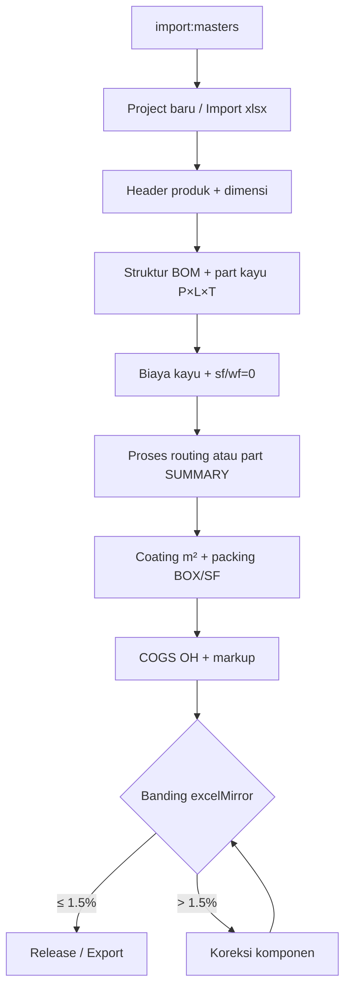

# Checklist Pengganti Excel — Optimasi Parity COGS

Dokumen ini merapikan seluruh data dan langkah agar app **Manufaktur BOM** dapat menggantikan Excel dengan deviasi rendah.

**Target release:** selisih **Total COGS** ≤ **1,5%** atau ≤ **Rp 25.000** vs sheet **SUMMARY COST**.

**Regresi otomatis:** `npm test`

---

## Ringkasan cepat (centang manual)

### Master & produk
- [ ] Master global ter-import (`npm run import:masters`)
- [ ] Work center / tarif routing tersedia (jika pakai routing detail)
- [ ] Kurs USD/EUR diset (jika banding multi-mata uang)
- [ ] Produk: **itemType**, **woodGradeId**, **coatingId**, **dimensi W×D×H**
- [ ] Header: kode BOM, nama, customer, versi

### BOM & material
- [ ] BOM: semua part + **qty** + **materialType** + **P×L×T** → **vol**
- [ ] Kayu: biaya dari master **ATAU** manual — **satu metode konsisten**
- [ ] **sf = 0 & wf = 0** jika biaya sudah include waste (setelah hitung master)
- [ ] Total material kayu ≈ **baris KAYU kolom material** Excel (bukan total baris KAYU penuh)
- [ ] Part non-kayu / part ringkasan SUMMARY (LAMINATING, AMPLAS, FINISHING, …)

### Proses, coating, packing
- [ ] Proses: **routing per part** ATAU **part ringkasan per baris SUMMARY**
- [ ] **mfgProcess** map ke kategori SUMMARY
- [ ] Total biaya proses > 0
- [ ] Coating: **coatingId** + **m² terkontrol** (jangan semua part berdimensi ikut hitung)
- [ ] Packing: material + routing + jalur **BOX** atau **SF**
- [ ] Biaya packing jalur aktif > 0

### COGS & verifikasi
- [ ] COGS config: OH pabrik **5%** + manajemen **2,5%**, markup **20%**, jalur packing
- [ ] Production cost > 0
- [ ] Banding **production & COGS** vs Excel / `excelMirror.summaryCost`
- [ ] Selisih dalam toleransi
- [ ] `npm test` lulus
- [ ] Tidak campur import Excel + hitung ulang master pada part yang sama
- [ ] Export Summary setelah parity OK

### Opsional
- [ ] Kapasitas kontainer (20ft / 40ft / 40HC)
- [ ] Mirror HPP mentah & supplier
- [ ] PICK LIST
- [ ] Foto part (UX saja)

---

## Alur kerja: project kosong → COGS



---

## Referensi angka ZAN-100

| Komponen | Excel (Rp) | Catatan |
|----------|------------|---------|
| Material kayu (kolom material) | ~781.738 | Bukan total baris KAYU ~1.291.225 |
| Production cost | ~2.043.407 | Material + proses + packing + coating |
| **Total COGS** | **~2.196.662** | + OH 5% + 2,5% |
| Packing BOX | ~57.936 | Material + tenaga |

---

## Pitfall (hindari)

| Masalah | Dampak | Solusi |
|---------|--------|--------|
| Double SF/WF setelah hitung master | Material +30% | `sf=0`, `wf=0` — waste sudah di `biaya` |
| Semua part ikut luas coating | Coating membengkak | Hanya part `finishing` / `surfaceM2` / meta |
| Proses kosong | COGS terlalu rendah | Routing atau part ringkasan SUMMARY |
| Hanya HPP mentah kayu | Material salah vs SUMMARY | Kalibrasi ke kolom material KAYU |
| Import + hitung master ulang | Struktur biaya campur | Satu sumber biaya per part |

---

## Di aplikasi

Tab **COGS & Pricing** → panel **Checklist Pengganti Excel** (audit live per project).

Kode: `src/data/excelParityChecklist.js`, `src/utils/excelParityAudit.js`

---

## Perintah

```bash
npm run import:masters    # master global
npm run import:samples      # sample project termirror
npm test                  # regresi parity
```

Lihat juga: [Excel-vs-App.md](./Excel-vs-App.md), [PRD-BOM-Excel-Parity.md](./PRD-BOM-Excel-Parity.md)
