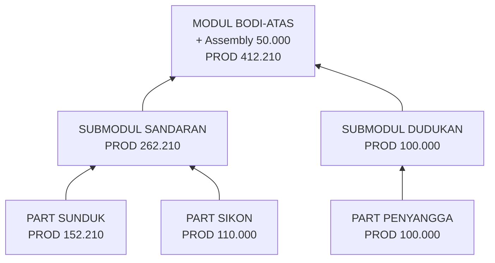

# Sample: Kolom MAT · PROD · PROD/U di Tab Struktur

Dokumen referensi singkat untuk membaca kolom finansial di tabel **Struktur / Material** (MODUL → SUBMODUL → PART).

> **Sumber logika app:** `src/services/bomCalculations.js` (`computeNodeDisplayFinancials`, `computePartDisplayFinancials`) dan `src/utils/bomCostRollup.js` (`computePartCostRow`, `rollupTreeCosts`).

---

## 1. Definisi kolom

| Kolom | PART | MODUL / SUBMODUL |
|-------|------|------------------|
| **MAT** | Harga material **per 1 unit** (`biaya`) | **Total material** semua anak (rollup `matAdjusted`) |
| **PROD** | Material total + proses baris | Total material anak + total proses anak + proses di node induk |
| **PROD/U** | **PROD ÷ qty** (biaya per 1 pcs part) | **= PROD** (total rollup; **tidak** dibagi qty node) |

### Rumus PART

```
Material total = biaya × qty  (+ SF/WF jika aktif)
PROD           = Material total + Proses
PROD/U         = PROD ÷ qty
```

### Rumus MODUL / SUBMODUL

```
PROD   = Σ PROD anak + proses yang disimpan di node induk
PROD/U = PROD   (angka sama; qty modul/submodul tidak dipakai)
MAT    = Σ material anak (bukan harga satuan)
```

---

## 2. Sample hierarki (data fiktif)

Asumsi contoh: **SF = 0%**, **WF = 0%**, kurs USD/EUR diabaikan.

### 2.1 Pohon struktur

```text
📦 MODUL BODI-ATAS                    qty = 1
│   proses sendiri: Assembly          Rp 50.000
│
├── 📁 SUBMODUL SANDARAN              qty = 1
│   │
│   ├── 🔩 PART SUNDUK SANDARAN       qty = 2   biaya = 46.105   proses = 60.000
│   └── 🔩 PART SIKON                 qty = 1   biaya = 80.000   proses = 30.000
│
└── 📁 SUBMODUL DUDUKAN               qty = 1
    │
    └── 🔩 PART PENYANGGA             qty = 4   biaya = 25.000   proses = 0
```

### 2.2 Data mentah per baris

| ID | Level | Nama | qty | biaya (MAT unit) | Proses | SF | WF |
|----|-------|------|-----|------------------|--------|----|----|
| M1 | MODUL | BODI-ATAS | 1 | — | 50.000 (Assembly) | — | — |
| S1 | SUBMODUL | SANDARAN | 1 | — | — | — | — |
| P1 | PART | SUNDUK SANDARAN | 2 | 46.105 | 60.000 | 0 | 0 |
| P2 | PART | SIKON | 1 | 80.000 | 30.000 | 0 | 0 |
| S2 | SUBMODUL | DUDUKAN | 1 | — | — | — | — |
| P3 | PART | PENYANGGA | 4 | 25.000 | 0 | 0 | 0 |

---

## 3. Perhitungan PART (level paling bawah)

| Baris | qty | MAT | Material total | Proses | PROD | PROD/U |
|-------|-----|-----|----------------|--------|------|--------|
| P1 SUNDUK | 2 | 46.105 | 92.210 | 60.000 | **152.210** | **76.105** |
| P2 SIKON | 1 | 80.000 | 80.000 | 30.000 | **110.000** | **110.000** |
| P3 PENYANGGA | 4 | 25.000 | 100.000 | 0 | **100.000** | **25.000** |

**Contoh P1 (SUNDUK):**

```
MAT         = 46.105
Material    = 46.105 × 2 = 92.210
PROD        = 92.210 + 60.000 = 152.210
PROD/U      = 152.210 ÷ 2 = 76.105
```

---

## 4. Rollup SUBMODUL

### SUBMODUL SANDARAN (S1)

| Komponen | Nilai |
|----------|-------|
| Material anak | 92.210 + 80.000 = **172.210** |
| Proses anak | 60.000 + 30.000 = **90.000** |
| **PROD** | **262.210** |
| **PROD/U** | **262.210** (= PROD, tidak ÷ qty) |
| **MAT (tampilan)** | **172.210** (total, bukan satuan) |

### SUBMODUL DUDUKAN (S2)

| Komponen | Nilai |
|----------|-------|
| Material anak | **100.000** |
| Proses anak | **0** |
| **PROD** | **100.000** |
| **PROD/U** | **100.000** |
| **MAT (tampilan)** | **100.000** |

---

## 5. Rollup MODUL

### MODUL BODI-ATAS (M1)

| Komponen | Nilai |
|----------|-------|
| Material semua anak | 172.210 + 100.000 = **272.210** |
| Proses anak | 90.000 + 0 = **90.000** |
| Proses modul (Assembly) | **50.000** |
| Proses total | **140.000** |
| **PROD** | 272.210 + 140.000 = **412.210** |
| **PROD/U** | **412.210** (= PROD) |
| **MAT (tampilan)** | **272.210** |

---

## 6. Tampilan lengkap (satu tabel — seperti di UI)

| Level | Nama | qty | MAT | PROD | PROD/U | Catatan |
|-------|------|-----|-----|------|--------|---------|
| MODUL | BODI-ATAS | 1 | 272.210 | 412.210 | 412.210 | Rollup + Assembly 50.000 |
| SUBMODUL | SANDARAN | 1 | 172.210 | 262.210 | 262.210 | Σ P1 + P2 |
| PART | SUNDUK SANDARAN | 2 | 46.105 | 152.210 | 76.105 | PROD/U dibagi qty |
| PART | SIKON | 1 | 80.000 | 110.000 | 110.000 | PROD/U = PROD |
| SUBMODUL | DUDUKAN | 1 | 100.000 | 100.000 | 100.000 | Tanpa proses |
| PART | PENYANGGA | 4 | 25.000 | 100.000 | 25.000 | PROD/U dibagi qty |

---

## 7. Diagram alur rollup



---

## 8. Eksperimen: pengaruh qty

### 8.1 MODUL — qty tidak mempengaruhi PROD/U

| Skenario | qty MODUL | PROD | PROD/U |
|----------|-----------|------|--------|
| Default | 1 | 412.210 | 412.210 |
| Qty diubah | 2 | 412.210 | **412.210** (tetap) |

Qty modul/submodul **tidak** dipakai untuk membagi PROD/U.

### 8.2 PART — qty mempengaruhi PROD/U

| Skenario | qty PART | Material | Proses | PROD | PROD/U |
|----------|----------|----------|--------|------|--------|
| P1 default | 2 | 92.210 | 60.000 | 152.210 | 76.105 |
| P1 qty=4 | 4 | 184.420 | 60.000 | 244.420 | **61.105** |

Proses part **tidak** ikut terbagi; yang dibagi hanya total PROD.

---

## 9. Ringkasan 3 aturan

1. **PART** → MAT = harga 1 unit; PROD/U = biaya per 1 pcs (`PROD ÷ qty`).
2. **SUBMODUL / MODUL** → PROD/U = PROD total subtree; **tidak dibagi qty**.
3. **Biaya per 1 produk jadi** → lihat level **COGS / Summary produk**, bukan baris MODUL di tabel Struktur.

---

## 10. Referensi kode

| File | Fungsi | Peran |
|------|--------|-------|
| `src/utils/bomCostRollup.js` | `computePartCostRow` | Hitung material + proses per PART |
| `src/utils/bomCostRollup.js` | `rollupTreeCosts` | Agregasi anak + proses induk |
| `src/services/bomCalculations.js` | `computePartDisplayFinancials` | PROD/U PART = PROD ÷ qty |
| `src/services/bomCalculations.js` | `computeNodeDisplayFinancials` | PROD/U MODUL = PROD (sama) |
| `src/pages/BOMEditor.jsx` | render kolom Struktur | PART pakai `prodUnit`; selain PART pakai `hargaProduksiIDR` |

---

*Sample data fiktif untuk training/UAT. Parity nyata: sample ZAN-100 vs Excel SUMMARY COST.*

**Lihat juga:** [FAQ-Part-Biaya-Komponen.md](./FAQ-Part-Biaya-Komponen.md) — penjelasan PART vs produk jadi, FAQ stakeholder, paragraf siap presentasi.
